# oficina-billing-service

Microsserviço responsável por orçamento, aprovação, recusa, pagamento e integração financeira da plataforma de oficina.

Este repositório segue a governança definida em [../oficina-platform](../oficina-platform/). Para tarefas automatizadas, leia também [AGENTS.md](AGENTS.md) e [TODO.md](TODO.md).

## Responsabilidades

- gerar e consultar orçamentos;
- aprovar e recusar orçamentos;
- registrar, confirmar, recusar e cancelar pagamentos;
- manter histórico e status financeiro da OS;
- integrar com provedor financeiro quando aplicável;
- produzir e consumir eventos financeiros usados pela Saga.

O serviço não é dono de Cliente, Veículo, Ordem de Serviço, catálogo técnico, estoque, diagnóstico ou execução.

## Saga orquestrada

A plataforma usa **Saga orquestrada** pelo `oficina-os-service`, conforme a [ADR-009 - Estratégia de Saga Pattern](../oficina-platform/adr/ADR-009%20-%20Estratégia%20de%20Saga%20Pattern.md), os [Fluxos da Saga da Ordem de Serviço](../oficina-platform/docs/architecture/saga-flows.md) e o [Contrato de Saga do oficina-os-service](../oficina-platform/contracts/saga/oficina-os-saga-v1.md).

O `oficina-os-service` foi escolhido como orquestrador porque é a autoridade sobre o estado global da Ordem de Serviço e concentra a sequência distribuída do processo. Essa escolha mantém o fluxo explícito, melhora a rastreabilidade e evita que compensações fiquem dispersas entre os serviços participantes.

O `oficina-billing-service` participa da Saga como autoridade financeira. Ele gera orçamento, registra aprovação ou recusa, solicita pagamento e publica os eventos financeiros consumidos pelo orquestrador. O serviço não decide sozinho o estado global da OS; ele preserva seu banco e domínio financeiro enquanto responde a comandos idempotentes e eventos definidos nos contratos da plataforma.

## Stack

- Java 25
- Quarkus 3.37.0
- PostgreSQL no database `oficina_billing`
- Flyway para migrations
- JWT, OpenAPI, Health, métricas Prometheus, logs JSON e OpenTelemetry

## Arquitetura

```mermaid
flowchart LR
  HTTP["APIs REST<br/>orçamentos e pagamentos"] --> Web["framework/web<br/>Resources e composição CDI"]
  Web --> Controllers["interfaces/controllers"]
  Controllers --> UseCases["core/usecases<br/>fluxos financeiros"]
  UseCases --> Domain["core/entities<br/>Orçamento e Pagamento"]
  UseCases --> Ports["core/interfaces<br/>portas de persistência,<br/>mensageria e pagamento"]
  Controllers --> Presenters["interfaces/presenters"]
  Presenters --> HTTP

  Ports --> DBAdapter["framework/db"]
  DBAdapter --> Postgres[("PostgreSQL oficina_billing<br/>orçamentos, pagamentos,<br/>Inbox, Outbox e idempotência")]
  Ports --> Outbox["framework/messaging<br/>worker da Outbox"]
  Outbox --> SNS["SNS<br/>eventos financeiros internos"]
  SagaSNS["SNS<br/>comandos e eventos da Saga"] --> SQS["SQS do oficina-billing-service"]
  SQS --> Consumers["consumers idempotentes"]
  Consumers --> UseCases

  Ports --> MPAdapter["framework/payments<br/>MercadoPagoPaymentProvider"]
  MPAdapter --> MP["API Mercado Pago"]
  MP -. "resposta do provedor<br/>não é evento de domínio" .-> MPAdapter
  MPAdapter --> UseCases
  UseCases --> Outbox

  OS["oficina-os-service<br/>orquestrador da Saga"] --> SagaSNS
  SNS --> OS
  Web -. "métricas, traces e logs" .-> Telemetry["Coletor OTLP"]

  classDef core fill:#e5f5ec,stroke:#176b45,color:#14202b;
  classDef adapter fill:#e7f1fa,stroke:#1f5f99,color:#14202b;
  classDef data fill:#fff3d6,stroke:#7a4b00,color:#14202b;
  classDef event fill:#f3e8ff,stroke:#6b21a8,color:#14202b;
  classDef observe fill:#fdeaea,stroke:#a22929,color:#14202b;
  class Domain,UseCases,Ports core;
  class HTTP,Web,Controllers,Presenters,DBAdapter,Outbox,Consumers,MPAdapter adapter;
  class Postgres,MP data;
  class SNS,SagaSNS,SQS,OS event;
  class Telemetry observe;
```



O Mercado Pago é uma integração externa síncrona: sua resposta é mapeada para o domínio antes que a transação local e a Outbox produzam eventos internos. O Billing não altera diretamente o estado global da OS; essa autoridade permanece no orquestrador.

## Setup local

Pré-requisitos:

- Java 25;
- Docker, para build de imagem e dependências locais;
- acesso ao repositório `../oficina-platform`, usado pelos testes de contrato;
- acesso opcional ao repositório `../oficina-infra`, usado para subir dependências compartilhadas da suíte.

Ferramentas locais recomendadas para validação de CI/CD, Dockerfile e scripts estão em [Ferramentas de validação local](../oficina-platform/docs/delivery/validation-tooling.md).

Dependências locais compartilhadas podem ser iniciadas pelo `oficina-infra`:

```bash
cd ../oficina-infra
docker compose -f compose.local.yml up -d postgres dynamodb localstack
scripts/local/bootstrap-local.sh
```

Volte para este repositório antes de executar o serviço:

```bash
cd ../oficina-billing-service
```

## Execução local

```bash
./mvnw quarkus:dev -Ppostgresql
./mvnw test -Ppostgresql
./mvnw -B verify -Ppostgresql -DskipITs=false -DfailIfNoTests=false
./mvnw -B package -Ppostgresql
```

O comando `verify` executa testes unitários, integração, contrato e verificação de cobertura JaCoCo.

Por padrão, a execução de desenvolvimento usa PostgreSQL local ou Dev Services. O modo em memória é permitido somente no profile de teste ou em uma execução local deliberada. Para iniciá-lo explicitamente sem banco, use:

```bash
./mvnw -Ppostgresql \
  -Doficina.persistence.kind=memory \
  -Dquarkus.datasource.active=false \
  -Dquarkus.hibernate-orm.active=false \
  -Dquarkus.flyway.active=false \
  quarkus:dev
```

### Proteção de configuração em runtime

O serviço considera o runtime protegido quando o profile Quarkus ativo é `prod` ou `lab`, ou quando `DEPLOYMENT_ENVIRONMENT=lab`. Nesses casos, a inicialização falha antes de aceitar tráfego se ocorrer qualquer uma destas condições:

- `oficina.persistence.kind` diferente de `postgresql`, datasource ou Flyway desabilitado;
- ausência de `DB_USERNAME`, `DB_PASSWORD`, `JDBC_DATABASE_URL` ou `REACTIVE_DATABASE_URL`;
- ausência de `OFICINA_AUTH_ISSUER`, audience diferente de `oficina-billing-service` ou ausência de `MP_JWT_VERIFY_PUBLICKEY_LOCATION`;
- mensageria, publisher, consumer ou worker desabilitado;
- ausência de `AWS_REGION`, credenciais AWS estáticas parciais ou uso de `OFICINA_MESSAGING_ENDPOINT_OVERRIDE`;
- uso de valores `PLACEHOLDER` nas configurações obrigatórias;
- `OFICINA_MERCADO_PAGO_ENABLED=true` sem Access Token, secret do webhook, e-mail pagador, URL ou modo `orders|payments` válidos;
- `OFICINA_MERCADO_PAGO_PAYER_FIRST_NAME=APRO` fora de `lab`/`test` ou sem o e-mail oficial de teste.

As credenciais AWS podem vir da cadeia padrão do SDK, incluindo IAM Role/IRSA. Quando configuradas estaticamente, informe `AWS_ACCESS_KEY_ID` e `AWS_SECRET_ACCESS_KEY`; inclua também `AWS_SESSION_TOKEN` para credenciais temporárias. Após validar a configuração, o startup confirma a conexão PostgreSQL, todos os tópicos SNS produzidos e todas as filas SQS consumidas. LocalStack e persistência em memória continuam disponíveis somente para testes e execução local explícita.

## Cobertura

O JaCoCo é executado no `verify`, gera relatório em `target/jacoco-report/` e falha o build quando a cobertura de instruções do bundle fica abaixo de 90%. O [Template GitHub Actions para Microsserviços](../oficina-platform/templates/github-actions/README.md) publica esse diretório como artifact `jacoco-report-oficina-billing-service` e envia `target/jacoco-report/jacoco.xml` ao SonarCloud.

Evidência local de cobertura em 2026-07-12:

```text
./mvnw -B verify -Ppostgresql -DskipITs=false -DfailIfNoTests=false
instruction=93.32% branch=80.26% line=92.64% complexity=84.50%
Tests run: 117, Failures: 0, Errors: 0, Skipped: 0
BUILD SUCCESS
```

## CI/CD

Os workflows ficam em [.github/workflows/service-ci.yml](.github/workflows/service-ci.yml) e [.github/workflows/open-pr-to-main.yml](.github/workflows/open-pr-to-main.yml), derivados do [Template GitHub Actions para Microsserviços](../oficina-platform/templates/github-actions/README.md).

Pull requests e pushes na `main` executam o check `service-ci-validate` com `./mvnw -B verify -Ppostgresql -DskipITs=false -DfailIfNoTests=false`, validam a cobertura mínima de 90%, publicam o artifact `jacoco-report-oficina-billing-service` e executam SonarCloud com o relatório `target/jacoco-report/jacoco.xml`. O secret `SONAR_TOKEN` deve existir no repositório ou na organização GitHub, e a Automatic Analysis do SonarCloud deve ficar desabilitada para evitar análise duplicada sem cobertura.

A publicação de imagem e o deploy Kubernetes são automáticos por padrão em `main` e podem ser desligados explicitamente:

- `ENABLE_IMAGE_PUBLISH=false` desabilita consulta ao ECR, build/push da imagem Docker e release com metadados da imagem;
- `ENABLE_K8S_DEPLOY=false` desabilita materialização ou atualização do Deployment no EKS e validação do rollout;
- com as variáveis ausentes, o workflow publica imagem/release quando necessário e aplica o Deployment no EKS;
- em `workflow_dispatch`, os inputs `publish_image` e `deploy` permitem forçar esses estágios mesmo quando as variáveis foram desabilitadas.

O workflow não usa GitHub Environment para evitar aprovação manual nos jobs. As variáveis e secrets de AWS/ECR/EKS devem estar em nível de repositório ou organização, e o controle manual do fluxo acontece no merge do PR aberto automaticamente a partir da branch `develop`.

Quando `ENABLE_K8S_DEPLOY` não é `false`, o workflow valida e aplica a base canônica em `k8s/base/`, usando o `oficina-infra` para compor os valores e secrets do ambiente `lab`, aguarda o rollout no EKS e confere a imagem final. Após recriar a infraestrutura base do lab, não é necessário executar um segundo `Deploy Lab` apenas para materializar este serviço.

## Validação de contratos

O teste [PlatformContractsTest](src/test/java/br/com/oficina/billing/contracts/PlatformContractsTest.java) valida o serviço contra os contratos canônicos em `../oficina-platform/contracts`: OpenAPI, schemas JSON de eventos, [Contrato de Erros REST](../oficina-platform/contracts/error-model.md), [Contrato de Idempotência](../oficina-platform/contracts/idempotency.md) e [Contrato de Saga do oficina-os-service](../oficina-platform/contracts/saga/oficina-os-saga-v1.md).

## Docker

```bash
docker build --build-arg MAVEN_PROFILE=postgresql -t oficina-billing-service:local .
docker run --rm -p 8080:8080 --env-file <arquivo-seguro-com-configuracao> oficina-billing-service:local
```

A imagem inicia no profile `prod`; portanto, o arquivo informado ao `docker run` deve conter toda a configuração obrigatória descrita em [Proteção de configuração em runtime](#proteção-de-configuração-em-runtime).

## Kubernetes

A estratégia de entrega dos manifests está definida em [Estratégia de entrega dos manifestos Kubernetes](../oficina-platform/docs/infrastructure/kubernetes-manifest-strategy.md).

Este repositório é a fonte canônica do Dockerfile e da base Kubernetes executável em [`k8s/base/`](k8s/base/). O `oficina-infra` mantém a composição, os secrets e os componentes compartilhados do ambiente `lab`; o template normativo permanece em [Template Kubernetes do oficina-billing-service](../oficina-platform/templates/kubernetes/base/oficina-billing-service/).

O deploy automatizado com `ENABLE_K8S_DEPLOY` diferente de `false` materializa o Deployment quando ele ainda não existe, atualiza a imagem quando ele já existe e valida o rollout no EKS usando o script canônico `scripts/manual/apply-microservices.sh` do `oficina-infra`.

## Endpoint técnico

- `GET /api/v1/status`: expõe identidade do serviço, ambiente e status técnico básico.

Health checks do Quarkus ficam em `/q/health`, `/q/health/live` e `/q/health/ready`.

## Swagger/OpenAPI

O contrato canônico do serviço é a [OpenAPI do oficina-billing-service](../oficina-platform/contracts/openapi/oficina-billing-service.yaml), mantida no repositório de plataforma.

Com o serviço em execução local na porta `8080`, a documentação gerada pelo Quarkus fica disponível em:

- Swagger UI: `http://localhost:8080/q/swagger-ui/`;
- OpenAPI YAML: `http://localhost:8080/q/openapi`;
- OpenAPI JSON: `http://localhost:8080/q/openapi?format=json`.

O teste [PlatformContractsTest](src/test/java/br/com/oficina/billing/contracts/PlatformContractsTest.java) valida que a OpenAPI gerada em runtime mantém os caminhos e métodos definidos no contrato canônico.

## APIs financeiras

O domínio financeiro inicial expõe as rotas canônicas da OpenAPI:

- `POST /api/v1/orcamentos`
- `GET /api/v1/orcamentos/{orcamentoId}`
- `GET /api/v1/ordens-servico/{ordemServicoId}/orcamentos`
- `POST /api/v1/orcamentos/{orcamentoId}/aprovacao`
- `POST /api/v1/orcamentos/{orcamentoId}/recusa`
- `GET|POST /api/v1/ordens-servico/{ordemServicoId}/orcamento-link`
- `POST /api/v1/orcamentos/{orcamentoId}/notificacao/reenvio`
- `GET|POST /api/v1/ordens-servico/{ordemServicoId}/acompanhar-link`, `/aprovar-link` e `/recusar-link` somente para compatibilidade com capabilities já emitidas
- `POST /api/v1/pagamentos`
- `GET /api/v1/pagamentos/{pagamentoId}`
- `GET /api/v1/ordens-servico/{ordemServicoId}/pagamentos`
- `POST /api/v1/pagamentos/{pagamentoId}/confirmacao`
- `POST /api/v1/pagamentos/{pagamentoId}/recusa`
- `POST /api/v1/pagamentos/{pagamentoId}/cancelamento`
- `GET /api/v1/dashboard/faturamento`: retorna contagens e até cinco atenções financeiras para `administrativo` e `recepcionista`.

Os repositórios de orçamento, pagamento, projeção financeira, eventos consumidos, idempotência e Outbox usam PostgreSQL por padrão, com migrations Flyway e seed limpo em `src/main/resources/db/migration/`. O modo em memória fica restrito ao profile de testes ou à execução local explícita documentada acima. Em `prod` e `lab`, a publicação e o consumo reais em SNS/SQS são obrigatórios.

O serviço mantém uma projeção financeira local persistida por eventos. Ao consumir `diagnosticoFinalizado`, persiste o snapshot de peças e serviços e gera automaticamente o orçamento, publicando `orcamentoGerado` com a mesma correlação da jornada. A rota `POST /api/v1/orcamentos` permanece disponível para operação explícita. Um orçamento aceita no máximo um pagamento; nova tentativa para o mesmo `orcamentoId` retorna conflito canônico `DUPLICATE_RESOURCE`.

Ao consumir `ordemDeServicoCriada`, o serviço também projeta localmente o e-mail canônico do cliente. Após gerar o orçamento, cria uma capability `DECIDIR` aleatória de 256 bits, persiste apenas o hash SHA-256 com validade de 24 horas e solicita à `oficina-notificacao-lambda` a entrega de um único link. A página pública reúne itens, total, aprovação e recusa, revalida token, OS, orçamento, expiração e uso e registra exatamente uma decisão. Administrativo e recepcionista podem reenviar a solicitação enquanto o orçamento estiver `GERADO`; o comando idempotente invalida links anteriores e emite uma nova capability sem recriar o orçamento. As rotas antigas permanecem apenas para links já emitidos. Em `lab` e `prod`, as URLs pública e de notificação usam `OFICINA_AUTH_ISSUER` como fallback, podendo ser separadas com as variáveis abaixo.

## Integração Mercado Pago

A integração com Mercado Pago é opcional e fica desabilitada por padrão. Quando `OFICINA_MERCADO_PAGO_ENABLED=true`, o Access Token e o secret do webhook passam a ser obrigatórios já na inicialização. O registro de pagamento PIX em `POST /api/v1/pagamentos` cria por padrão uma order em `/v1/orders`, com `type=online`, `processing_mode=automatic`, uma única transação PIX e o `pagamentoId` em `external_reference` e `X-Idempotency-Key`.

`OFICINA_MERCADO_PAGO_API_MODE=orders` é o modo canônico. O valor temporário `payments` permite rollback apenas da criação; a migration V9 classifica referências existentes como `PAYMENT`, enquanto novas orders são persistidas como `ORDER`. Consultas e webhooks usam esse tipo persistido, nunca o formato de `transacaoExternaId`, de modo que orders já criadas continuam reconciliáveis mesmo se a criação voltar temporariamente para Payments.

No `lab`, o cenário automático usa `OFICINA_MERCADO_PAGO_PAYER_EMAIL=test_user_br@testuser.com` e `OFICINA_MERCADO_PAGO_PAYER_FIRST_NAME=APRO`. O startup rejeita `APRO` fora de `lab` ou `test`; produção não pode conter esse marcador.

Excepcionalmente durante o diagnóstico do `hash_mismatch`, `OFICINA_MERCADO_PAGO_WEBHOOK_RAW_CAPTURE_ENABLED=true` captura a primeira requisição do webhook em `${user.dir}/.oficina-diagnostics/mercado-pago-webhook-request.json` — `/work/.oficina-diagnostics/mercado-pago-webhook-request.json` na imagem atual —, incluindo URI, query string, headers e corpo brutos. A opção é desabilitada por padrão e o startup a rejeita fora de `lab` ou `test`; o arquivo é efêmero, limitado a 1 MiB, criado uma única vez em diretório privado com modo `0700` e protegido com modo `0600`. O procedimento autorizado deve ler uma única evidência, apagar imediatamente o arquivo, remover a variável do deployment e confirmar o novo rollout. A classe, a configuração e esta orientação são instrumentação temporária e devem ser removidas na primeira versão posterior à conclusão do diagnóstico.

Antes da chamada externa, o Billing reivindica no PostgreSQL um claim com lease por `orcamentoId`. Somente o proprietário chama o provedor; consumidores concorrentes aguardam o pagamento persistido e reutilizam a mesma Outbox idempotente. Falha do proprietário libera o claim para takeover por outro consumidor, mas continua retentável quando não existe concorrente que conclua o pagamento. Os timeouts padrão de conexão e leitura são, respectivamente, 3 e 10 segundos, inferiores ao lease de 30 segundos.

Mapeamento de status de Orders:

- `created`, `processing` e `action_required/waiting_payment|waiting_transfer`: pagamento local `CRIADO`;
- `processed/accredited`: pagamento local `CONFIRMADO` e evento `pagamentoConfirmado`;
- `failed`, `canceled`, `expired`, `refunded` ou `charged_back`: pagamento local `RECUSADO` e evento `pagamentoRecusado`;
- combinações contraditórias ou desconhecidas: falha de dependência sem transição local.

Payments legados preservam a tradução `approved` para `CONFIRMADO`, estados terminais negativos para `RECUSADO` e demais estados para `CRIADO`. O webhook aceita `type=order` e, durante a compatibilidade, `type=payment`, valida HMAC com o `x-request-id` original, consulta o recurso externo e retorna `200` após processamento idempotente. Uma referência assinada que não pertence ao Billing também retorna `200`, sem consultar o provedor nem expor a existência de pagamentos; falhas transitórias continuam retentáveis. O `data.id` resolvido da query string ou, quando ela não for encaminhada pelo transporte, do corpo coerente participa do manifesto HMAC e é preservado exatamente como recebido, inclusive em IDs alfanuméricos de Orders. Quando ambos são enviados, valores divergentes são rejeitados antes da validação. O `ts` recebido permanece inalterado no manifesto HMAC; somente a verificação da tolerância normaliza epoch de 13 dígitos em milissegundos para segundos, preservando compatibilidade com notificações legadas de 10 dígitos. Rejeições registram apenas `webhookValidationReason`, com categoria de baixa cardinalidade (`secret_missing`, `request_id_missing`, `signature_missing`, `timestamp_invalid`, `hash_missing`, `timestamp_expired` ou `hash_mismatch`), sem incluir headers, identificadores, assinatura, corpo ou secret.

A integração atual com o Mercado Pago cobre PIX. Cartão exige tokenização ou dados de captura fora do contrato REST vigente e permanece como evolução posterior ou fluxo operacional manual.

As tentativas de integração expõem as métricas `payment.provider.enabled`, `payment.provider.requests.count`, `payment.provider.request.duration`, `payment.provider.amount`, `payment.provider.failures.count` e `payment.provider.unavailable.count`, conforme o [Padrão de Observabilidade Distribuída](../oficina-platform/docs/observability/observability.md). Os desfechos ficam limitados a `confirmed`, `rejected`, `pending`, `failure` e `not_integrated`; status desconhecidos do provedor são agregados como `other`. Falhas usam somente as categorias `configuration`, `timeout`, `communication`, `provider_http_error`, `invalid_response`, `unsupported_method` e `business_rejection`. IDs de pagamento, ordem de serviço ou transação, CPF, e-mail e `correlationId` não são usados como dimensões.

## Contratos

- [Contrato de APIs REST](../oficina-platform/contracts/Contrato%20de%20APIs%20REST.md)
- [OpenAPI do oficina-billing-service](../oficina-platform/contracts/openapi/oficina-billing-service.yaml)
- [Contrato de Eventos de Domínio](../oficina-platform/contracts/Contrato%20de%20Eventos%20de%20Domínio.md)
- [Contrato de Tópicos de Mensageria](../oficina-platform/contracts/Contrato%20de%20Tópicos%20de%20Mensageria.md)
- [Contrato de Erros REST](../oficina-platform/contracts/error-model.md)
- [Contrato de Idempotência](../oficina-platform/contracts/idempotency.md)
- [Fluxos da Saga da Ordem de Serviço](../oficina-platform/docs/architecture/saga-flows.md)

## Variáveis principais

- `DB_USERNAME`
- `DB_PASSWORD`
- `JDBC_DATABASE_URL`
- `REACTIVE_DATABASE_URL`
- `OFICINA_AUTH_ISSUER`
- `OFICINA_AUTH_AUDIENCE`
- `MP_JWT_VERIFY_PUBLICKEY_LOCATION`
- `OFICINA_MERCADO_PAGO_ENABLED`
- `OFICINA_MERCADO_PAGO_ACCESS_TOKEN`
- `OFICINA_MERCADO_PAGO_WEBHOOK_SECRET`
- `OFICINA_MERCADO_PAGO_WEBHOOK_RAW_CAPTURE_ENABLED` (temporária; somente `lab`/`test`)
- `OFICINA_MERCADO_PAGO_API_MODE`
- `OFICINA_MERCADO_PAGO_PAYER_EMAIL`
- `OFICINA_MERCADO_PAGO_PAYER_FIRST_NAME`
- `OFICINA_MERCADO_PAGO_API_URL`
- `OFICINA_APPROVAL_NOTIFICATIONS_ENABLED`
- `OFICINA_PUBLIC_API_URL`
- `OFICINA_NOTIFICATION_API_URL`
- `OFICINA_MESSAGING_ENABLED`
- `OFICINA_MESSAGING_PUBLISHER_ENABLED`
- `OFICINA_MESSAGING_CONSUMER_ENABLED`
- `OFICINA_MESSAGING_WORKER_ENABLED`
- `AWS_REGION`
- `AWS_ACCOUNT_ID`, opcional quando a conta pode ser resolvida via STS
- `AWS_ACCESS_KEY_ID` e `AWS_SECRET_ACCESS_KEY`, opcionais com IAM Role/IRSA
- `AWS_SESSION_TOKEN`, obrigatório somente para credenciais AWS temporárias
- `OTEL_EXPORTER_OTLP_ENDPOINT`
- `DEPLOYMENT_ENVIRONMENT`
- `oficina.persistence.kind`, valor build-time `postgresql` no runtime e `memory` apenas em testes ou execução local explícita

Em ambiente local, valores de desenvolvimento ficam em `src/main/resources/application.properties`. Em Kubernetes, variáveis de banco vêm do secret `oficina-billing-service-database-env`, e variáveis não sensíveis vêm do ConfigMap canônico em [`k8s/base/configmap.yaml`](k8s/base/configmap.yaml). O profile protegido não aceita os defaults locais de banco nem endpoints AWS locais.

## Estrutura

```text
src/main/java/br/com/oficina/billing/
  core/
  interfaces/
  framework/
src/main/resources/
  db/migration/
```

## Banco de dados local

O runtime usa adapters PostgreSQL para `orcamento`, `orcamento_item`, `pagamento`, `financeiro_item_projection`, `billing_consumed_event`, `outbox_event` e `idempotency_record`. O profile `postgresql` executa as migrations Flyway para o database `oficina_billing`.

Arquivos atuais:

- `src/main/resources/db/migration/V1__create_billing_schema.sql`
- `src/main/resources/db/migration/V2__seed_billing_data.sql`
- `src/main/resources/db/migration/V3__persist_billing_event_store.sql`
- `src/main/resources/db/migration/V4__create_idempotency_records.sql`

O seed usa IDs de Ordem de Serviço compatíveis com o seed do `oficina-os-service`, mas não cria foreign keys para tabelas de outro microsserviço.

## Mensageria local

A fronteira de mensageria local fica em `src/main/java/br/com/oficina/billing/framework/messaging/`. Em runtime PostgreSQL, o adapter fica em `src/main/java/br/com/oficina/billing/framework/db/PostgresBillingEventStore.java`; no profile de testes, `InMemoryBillingEventStore` mantém fixtures sem banco externo.

Ela cobre:

- consumo idempotente de eventos por `eventId`;
- projeção financeira de itens recebidos por eventos de OS e Execution;
- geração automática do orçamento após `diagnosticoFinalizado`;
- geração de Outbox para `orcamentoGerado`, `orcamentoAprovado`, `orcamentoRecusado`, `pagamentoSolicitado`, `pagamentoConfirmado` e `pagamentoRecusado`;
- publicação de pendentes no SNS canônico, com retry/backoff, status `PUBLISHED` após sucesso e `FAILED` quando tentativas são esgotadas;
- consumo por filas SQS com delete somente após persistência da projeção, idempotência ou comando financeiro.

Configuração principal:

- `OFICINA_MESSAGING_ENABLED`
- `OFICINA_MESSAGING_ENDPOINT_OVERRIDE`, somente para LocalStack em teste ou execução local
- `OFICINA_MESSAGING_PUBLISHER_BATCH_SIZE`
- `OFICINA_MESSAGING_PUBLISHER_MAX_ATTEMPTS`
- `OFICINA_MESSAGING_CONSUMER_MAX_MESSAGES`
- `OFICINA_MESSAGING_CONSUMER_WAIT_TIME_SECONDS`
- `AWS_REGION`, `AWS_ACCOUNT_ID`, `AWS_ACCESS_KEY_ID`, `AWS_SECRET_ACCESS_KEY` e `AWS_SESSION_TOKEN`

Os nomes físicos de tópicos e filas seguem o padrão do `oficina-infra`: pontos do tópico canônico são trocados por hífen, e filas consumidoras usam `<topico>.<servico-consumidor>`. A validação local de publicação e consumo SNS/SQS fica em [SnsSqsMessagingIntegrationTest](src/test/java/br/com/oficina/billing/framework/messaging/SnsSqsMessagingIntegrationTest.java), com LocalStack via Testcontainers.

## Próximo Trabalho

O [TODO.md](TODO.md) é o checklist histórico das entregas concluídas. Novos incrementos são controlados no [ROADMAP da plataforma](../oficina-platform/ROADMAP.md).
